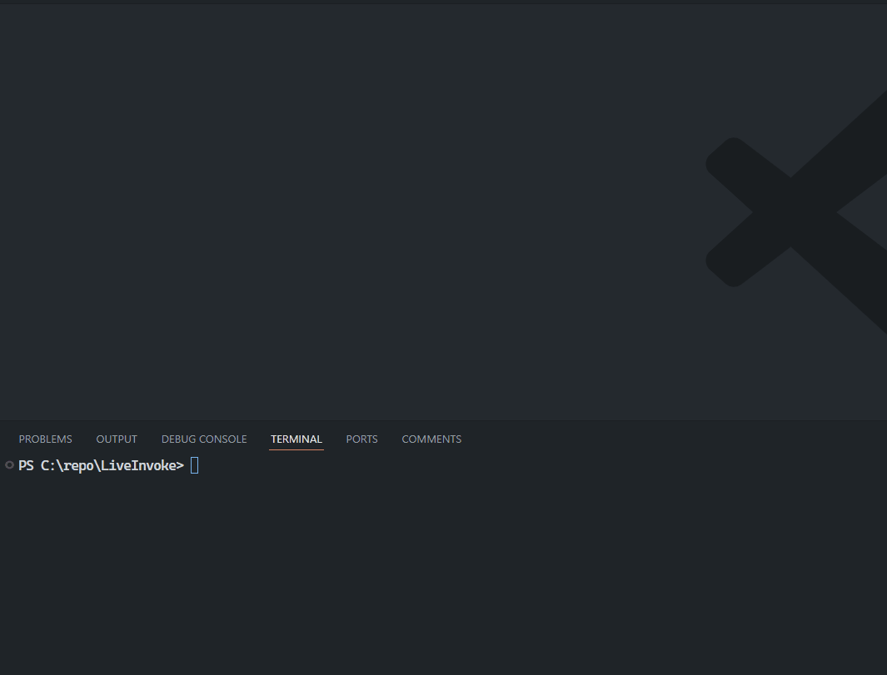

# `LiveInvoke`

This project is the result of an AI hackaton using various agents. I wanted to design an extension that allowed debugging of powershell scripts, without getting into any pre-setup steps like you have to use if you want to use the `launch.json` to debug a powershell script.

## How to use

- Install the extension
- open a powershell function in vscode

## Todo

- [x] Simple parsing of function headers
- [x] Add a run button that identifies the function and calls other code with the necessary metadata
- [x] Dynamically create an update the `launch.json` for a workspace to add the necessary `invoke`.
- [x] Create the local file necessary to actually run your app
- [x] Able to debug simple functions with a single click
- [ ] Should the working directory be updated so that when we call launch.json profile it changes working dir to the one containing the script?
- [ ] Allow setting of arguments via a temporary codelens UI
